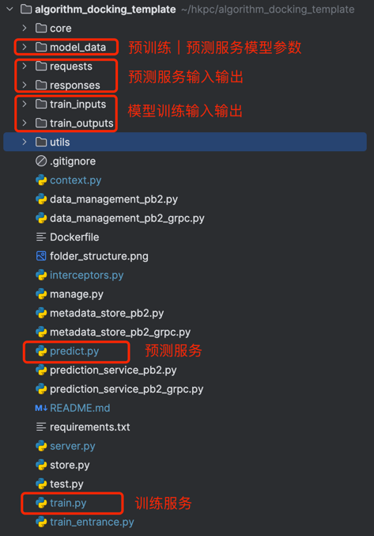
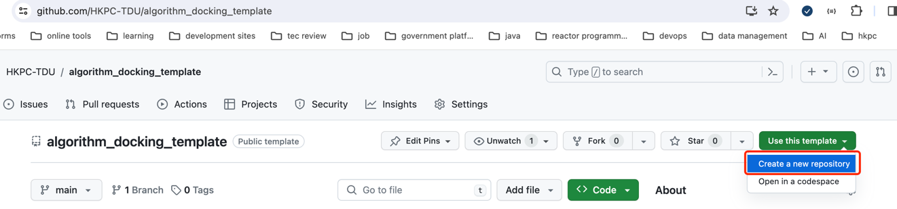
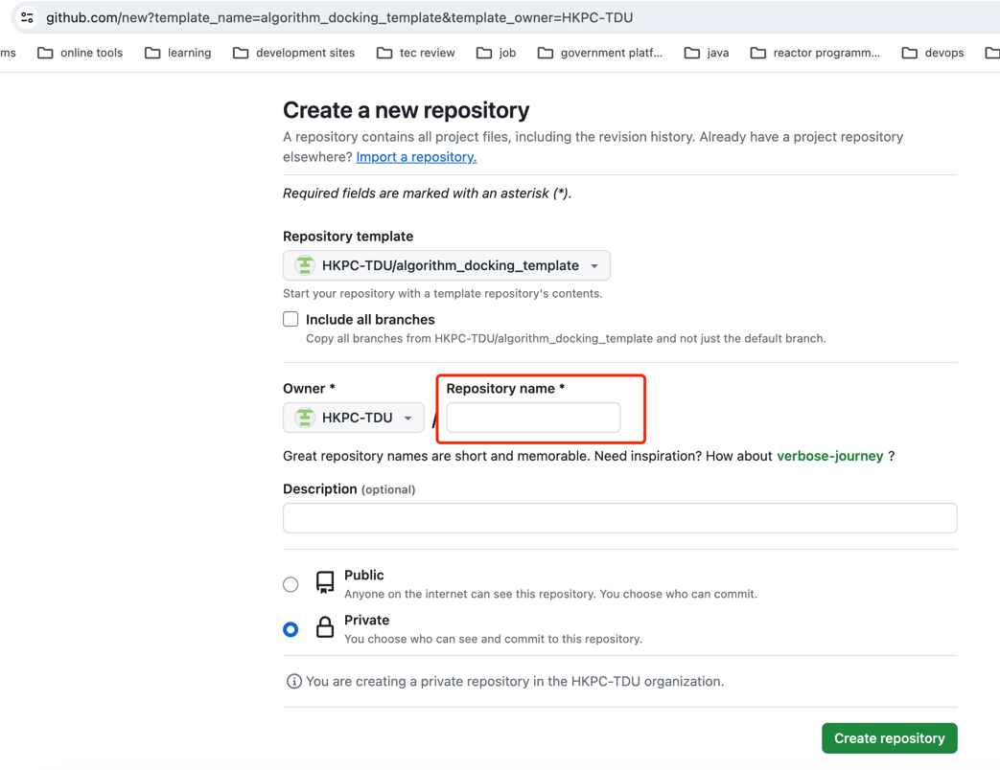

# algorithm_docking_template
通过运行环境的本地文件结构来解耦平台和算法。抽象平台与指定文件夹互操作，作为通用部分；算法通过指定文件夹读取数据并保存输出到指定文件夹。
## 1. 文件结构

## 2. 软件安装
- [安装git](https://git-scm.com/downloads)
- [安装Docker](https://docs.docker.com/engine/install/)
- [安装Python](https://www.python.org/downloads/) 建议安装3.8.0版本
- 安装Python包管理工具，任选其一
    - [安装VirtualEnv](https://virtualenv.pypa.io/en/latest/installation.html)
    - [安装Conda](https://conda.io/projects/conda/en/latest/user-guide/install/index.html)
## 3. 代码生成及管理
（1）在github上点击Create a new repository使用该template创建算法代码仓库



（2）建议使用算法名称创建repository



github-path=https&#58;//github.com/${Owner}/${Repository&nbsp;name}

## 4. 算法代码集成
把代码仓库clone到本地，就可以进行算法集成了，只需要自定义训练服务和预测服务的具体逻辑。
```commandline
git clone ${github-path}
```
### 4.1 环境准备

### 4.1.2 依赖包管理
```commandline
# VirtualEnv
virtualenv venv
source venv/bin/activate
# Conda
conda create --name template python=3.8
conda activate template
```
### 4.2 自定义算法代码

将算法代码Copy到当前代码仓库，以便后续集成训练服务及预测服务

### 4.3 自定义算法训练

代码文件路劲: train.py
```train.py
class Model:

        def __init__(self, inputs_folder, outputs_folder, history_model_folder):
        self.inputs_folder = inputs_folder
        self.outputs_folder = outputs_folder
        self.history_model_folder = history_model_folder

    def train(self):
        print(datetime.now().strftime("%Y-%m-%d %H:%M:%S"), 'load dataset from {0}'.format(self.inputs_folder))

        # codes of algorithm
        print('training')
        # codes of algorithm

        print(datetime.now().strftime("%Y-%m-%d %H:%M:%S"), 'save model in {0}'.format(self.outputs_folder))
```
类属性注释：

- self.inputs_folder ：对应文件夹train_inputs，训练数据路劲。

- self.outputs_folder ：对应文件夹train_outputs，模型输出路劲。

- self.history_model_folder ：对应文件夹model_data，如果模型需要预训练，上一次的模型训练结果可以在该文件夹读取，文件名与模型输出的一致。

### 4.3.1 本地调试模型训练
（1）安装依赖包
```commandline
# VirtualEnv
pip install minio==7.2.3 grpcio==1.60.0  protobuf==3.20.3
# Conda
conda install minio grpcio protobuf
```
Note：算法

（2）数据准备

如果没有train_inputs文件夹，在根目录下创建train_inputs文件夹，Copy训练数据到train_inputs文件夹。

（3）启动训练服务

```commandline
# VirtualEnv
python3 train_entrance.py
# Conda
conda run python train_entrance.py
```
（4）验证

检查输出到train_outputs文件夹的模型训练结果是否符合预期，如果是，算法训练编码工作就完成了。

### 4.4 自定义预测服务
代码文件路劲: predict.py
```predict.py
class ModelPredict:

        def __init__(self, inputs_folder, outputs_folder, model_folder):
        self.inputs_folder = inputs_folder
        self.outputs_folder = outputs_folder
        self.model_folder = model_folder

    def predict(self):
        print('load input from {0}'.format(self.inputs_folder))

        # codes of algorithm
        print('predict')
        # codes of algorithm

        print('save result in {0}'.format(self.outputs_folder))
```
类属性注释：

- self.model_folder ：对应文件夹model_data，这里存放的是模型训练结果，如果训练成功后的模型参数等。

- self.inputs_folder ：对应文件夹requests，请求数据路劲，请遍历文件夹获取请求数据。

- self.outputs_folder ：对应文件夹response，预测结果路劲，预测结束后，需要把预测结果文件保存到该文件夹。
如果输出的是图片，直接保存图片文件；如果是text信息，可保存为文本文件。

### 4.4.1 本地调试预测服务
（1）安装依赖包
```commandline
# VirtualEnv
pip install minio==7.2.3 grpcio==1.60.0  protobuf==3.20.3 grpcio-health-checking==1.48.2
# Conda
conda install minio grpcio protobuf grpcio-health-checking
```
（2）数据准备

Copy模型文件到model_data文件夹；如果没有requests文件夹，在根目录下创建requests文件夹，Copy测试数据到requests文件夹。

（3）启动预测服务
```commandline
# VirtualEnv
python3 server.py
# Conda
python server.py
```
（4）预测服务测试
```test.py
# tdu-platform-dm 为bucket
# ###为连接符
# datasets/20/versions-snapshots/hashAABQ为具体路劲
request_folder = 'tdu-platform-dm###datasets/20/versions-snapshots/hashAABQ'
result = stub.PredictorPredict(
    prediction_service_pb2.PredictorPredictRequest(
        document=request_folder
    )
)
```
- 执行测试代码
```commandline
# VirtualEnv
python3 test.py
# Conda
python test.py
```
验证输出到responses的预测结果是否符合预期，如果是，预测服务编码工作就完成了

## 5. 打包镜像
需要保证代码能成功打包成镜像。特别需要注意算法依赖包版本号管理，依赖包及版本号可记录在requirements.txt
```commandline
sh build-image.sh
```

