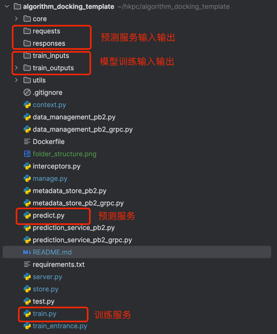

# algorithm_docking_template
通过运行环境的本地文件结构来解耦平台和算法。抽象平台与指定文件夹互操作，作为通用部分；算法通过指定文件夹读取数据并保存输出到指定文件夹。
## 1. 文件结构

## 2. 算法开发

### 2.1 算法代码
默认训练成功，可以添加熟练失败的逻辑

path: train.py
```train.py
class Model:

        def __init__(self, inputs_folder, outputs_folder, history_model_folder):
        self.inputs_folder = inputs_folder
        self.outputs_folder = outputs_folder
        self.history_model_folder = history_model_folder
        self.result = True

    def train(self):
        print(datetime.now().strftime("%Y-%m-%d %H:%M:%S"), 'load dataset from {0}'.format(self.inputs_folder))

        # codes of algorithm
        print('training')
        # codes of algorithm

        print(datetime.now().strftime("%Y-%m-%d %H:%M:%S"), 'save model in {0}'.format(self.outputs_folder))
        return self.result
```
self.inputs_folder 对应文件夹train_inputs

self.outputs_folder 对应文件夹train_outputs

self.history_model_folder 对应文件夹model_data

### 2.2 本地调试模型训练
（1）安装依赖包
```commandline
# VirtualEnv
pip install -r requirments.txt
# Conda
conda install minio grpcio grpcio-health-checking
```
（2）数据准备

Copy训练数据到train_inputs文件夹

（3）启动训练服务
```commandline
# VirtualEnv
python3 train_entrance.py
# Conda
conda run python train_entrance.py
```
（4）验证
检查模型输出到train_outputs文件夹

## 3. 预测服务开发

### 3.1 预测服务代码
path: predict.py
```predict.py
class ModelPredict:

        def __init__(self, inputs_folder, outputs_folder, model_folder):
        self.inputs_folder = inputs_folder
        self.outputs_folder = outputs_folder
        self.model_folder = model_folder

    def predict(self):
        print('load input from {0}'.format(self.inputs_folder))

        # codes of algorithm
        print('predict')
        # codes of algorithm

        print('save result in {0}'.format(self.outputs_folder))
```
self.inputs_folder 对应文件夹requests

self.outputs_folder 对应文件夹response

self.model_folder 对应文件夹model_data

### 3.2 本地调试预测服务
（1）安装依赖包
```commandline
# VirtualEnv
pip install -r requirments.txt
# Conda
conda install minio grpcio grpcio-health-checking
```
（2）启动预测服务
```commandline
# VirtualEnv
python3 server.py
# Conda
conda run python server.py
```
（3）预测服务测试

Copy预测数据到requests文件夹
```commandline
# VirtualEnv
python3 test.py
# Conda
conda run python test.py
```
验证预测结果输出到responses
